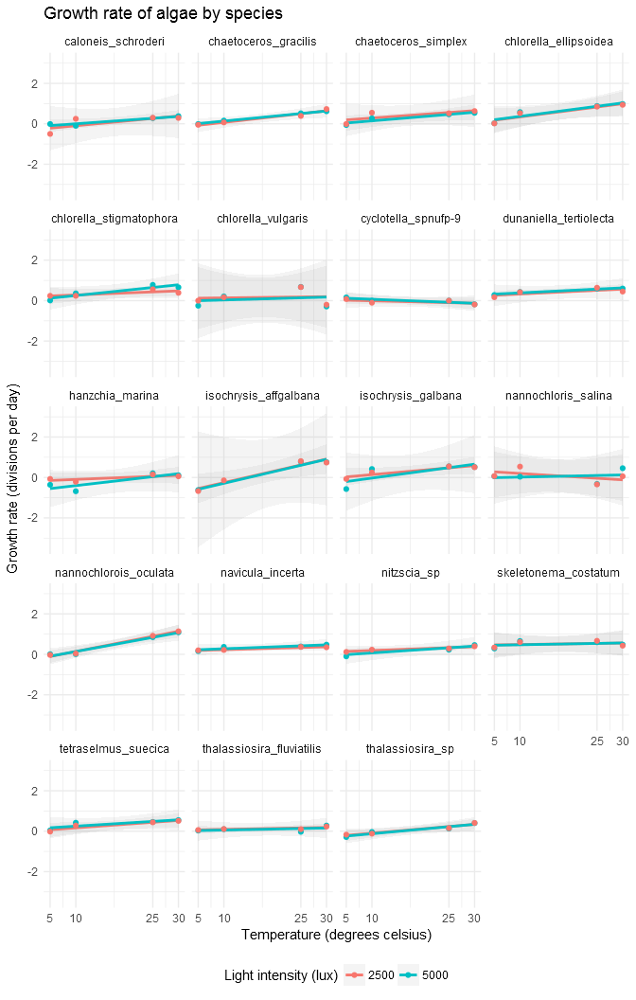
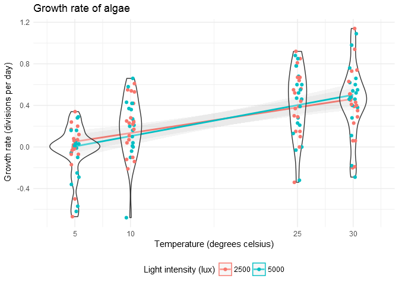

r/DataVizRequest for u/linkuei-teaparty
================
Luke Davis
July 30, 2017

``` r
library(ggplot2)
library(dplyr)
library(XML)
library(RCurl)
library(purrr)
library(tidyr)
library(stringr)
library(tibble)
```

Getting the Data
----------------

The data is stored as an HTML table [here](http://aquatext.com/tables/algaegrwth.htm). I'll parse the table out automatically with the `RCurl` and `XML` packages.

``` r
url <- getURL("http://aquatext.com/tables/algaegrwth.htm",
                 .opts = list(ssl.verifypeer = FALSE))
tables <- readHTMLTable(url) %>% set_names(c(1, 2, 3))
big_table_index <- which.max(unlist(map(tables, length)))
data_raw <- tables[[big_table_index]]
data_raw
```

    ##                                        V1    V2    V3    V4    V5    V6
    ## 1            Light\n      Intensity (lux)  5000  2500  5000  2500  5000
    ## 2                                 Species  <NA>  <NA>  <NA>  <NA>  <NA>
    ## 3                      Caloneis schroderi -0.01 -0.50  -0.1  0.25  0.28
    ## 4                    Chaetoceros gracilis -0.01 -0.05  0.16  0.07  0.52
    ## 5                     Chaetoceros simplex -0.06 -0.01  0.27  0.55  0.47
    ## 6                   Chlorella ellipsoidea  0.03  0.02  0.58  0.53  0.88
    ## 7                 Chlorella stigmatophora  0.01  0.24  0.36  0.24  0.78
    ## 8  Chlorella vulgaris\n      (freshwater) -0.25  0.00  0.21  0.17  0.68
    ## 9                  Dunaniella tertiolecta  0.28  0.17  0.43  0.42  0.60
    ## 10                  Cyclotella sp. NUFP-9  0.16  0.08  0.00  -0.1   0.0
    ## 11                        Hanzchia marina -0.36 -0.07 -0.68 -0.21  0.21
    ## 12                     Isochrysis galbana -0.57 -0.07  0.42  0.25  0.55
    ## 13                Isochrysis aff. galbana -0.62 -0.67 0..06 -0.14  0.78
    ## 14           Nannochlorois\n      oculata  0.01 -0.03  0.01  0.04  0.85
    ## 15                    Nannochloris salina  0.06  0.07  0.04  0.54 -0.32
    ## 16                       Navicula incerta  0.16   0.2  0.37  0.22  0.39
    ## 17                           Nitzscia sp.  -0.1  0.12   0.2  0.23  0.23
    ## 18                   Skeletonema costatum  0.29  0.34  0.66  0.61   0.6
    ## 19                    Tetraselmus suecica  0.04 -0.02  0.42  0.28  0.46
    ## 20              Thalassiosira fluviatilis  0.03  0.06  0.10  0.11 -0.03
    ## 21                      Thalassiosira sp. -0.29 -0.17 -0.04 -0.12  0.13
    ##       V7    V8    V9
    ## 1   2500  5000  2500
    ## 2   <NA>  <NA>  <NA>
    ## 3   0.30  0.38  0.29
    ## 4   0.39  0.62  0.73
    ## 5   0.52  0.54  0.63
    ## 6   0.85  0.98  0.94
    ## 7   0.56  0.66  0.39
    ## 8   0.67 -0.29 -0.20
    ## 9   0.64  0.60  0.45
    ## 10   0.0 -0.18 -0.19
    ## 11  0.15  0.11  0.06
    ## 12  0.55  0.52  0.51
    ## 13  0.81  0.76  0.74
    ## 14  0.92  1.09  1.14
    ## 15 -0.34  0.46  0.06
    ## 16  0.37  0.48  0.35
    ## 17  0.29  0.46   0.4
    ## 18  0.67  0.48  0.43
    ## 19  0.44  0.55  0.51
    ## 20   0.1  0.28  0.23
    ## 21  0.15  0.40  0.41

This looks OK, although it missed temperature because it has merged cells. I'll just add it in manually at a later step.

Data Cleaning
-------------

The data weirdly has variables as rows and observations as columns, so I'll transpose it before doing anything else. I'm also cleaning up the variable names.

``` r
col_names <- data_raw[, 1] %>% str_replace(" ", "_") %>% 
  str_replace_all("\\s|\\.", "") %>% str_replace("\\(.*\\)", "") %>% 
  tolower()
data <- as.tibble(t(data_raw[, -1]))
colnames(data) <- col_names
row.names(data) <- 1:nrow(data)
```

    ## Warning: Setting row names on a tibble is deprecated.

``` r
data
```

    ## # A tibble: 8 x 21
    ##   light_intensity species caloneis_schroderi chaetoceros_gracilis
    ## *           <chr>   <chr>              <chr>                <chr>
    ## 1            5000    <NA>              -0.01                -0.01
    ## 2            2500    <NA>              -0.50                -0.05
    ## 3            5000    <NA>               -0.1                 0.16
    ## 4            2500    <NA>               0.25                 0.07
    ## 5            5000    <NA>               0.28                 0.52
    ## 6            2500    <NA>               0.30                 0.39
    ## 7            5000    <NA>               0.38                 0.62
    ## 8            2500    <NA>               0.29                 0.73
    ## # ... with 17 more variables: chaetoceros_simplex <chr>,
    ## #   chlorella_ellipsoidea <chr>, chlorella_stigmatophora <chr>,
    ## #   chlorella_vulgaris <chr>, dunaniella_tertiolecta <chr>,
    ## #   `cyclotella_spnufp-9` <chr>, hanzchia_marina <chr>,
    ## #   isochrysis_galbana <chr>, isochrysis_affgalbana <chr>,
    ## #   nannochlorois_oculata <chr>, nannochloris_salina <chr>,
    ## #   navicula_incerta <chr>, nitzscia_sp <chr>, skeletonema_costatum <chr>,
    ## #   tetraselmus_suecica <chr>, thalassiosira_fluviatilis <chr>,
    ## #   thalassiosira_sp <chr>

Now that the data is in good shape I can add temperature in.

``` r
data$temperature <- unlist(lapply(c(5, 10, 25, 30), rep, 2))
```

Visualization
-------------

Our goal is to measure "temperature and light intensity and it's effects on growth rate." First we need to transform the data into long shape:

``` r
data_long <- data %>% 
  select(-species) %>% 
  mutate_all(as.numeric) %>% 
  gather(key = "species", value = "growth", -light_intensity, -temperature) %>% 
  mutate(light_intensity = as.factor(light_intensity))
```

    ## Warning in evalq(as.numeric(isochrysis_affgalbana), <environment>): NAs
    ## introduced by coercion

Because `light_intensity` only has two values I'm going to use it for color groups. Even though temperature only takes on four values it's still useful to treat it as continuous because those four values are not evenly spaced. I'll also add in simple linear fits for each species that should help make it clear if there's any differences in the relationship between temperature and growth rate at different light intensities.

``` r
ggplot(data_long, aes(x = temperature, y = growth, color = light_intensity)) +
  geom_smooth(method = "lm", alpha = 0.1) +
  geom_point() +
  scale_x_continuous(breaks = c(5, 10, 25, 30)) +
  facet_wrap(~ species) +
  theme_minimal()
```

    ## Warning: Removed 1 rows containing non-finite values (stat_smooth).

    ## Warning: Removed 1 rows containing missing values (geom_point).



We can also do a version without the species facetting:

``` r
ggplot(data_long, aes(x = temperature, y = growth, color = light_intensity)) +
  geom_smooth(method = "lm", alpha = 0.1) +
  geom_violin(aes(group = temperature), alpha = 0.3) +
  geom_jitter(width = 0.4, height = 0) +
  scale_x_continuous(breaks = c(5, 10, 25, 30)) +
  theme_minimal()
```

    ## Warning: Removed 1 rows containing non-finite values (stat_smooth).

    ## Warning: Removed 1 rows containing non-finite values (stat_ydensity).

    ## Warning: Removed 1 rows containing missing values (geom_point).


